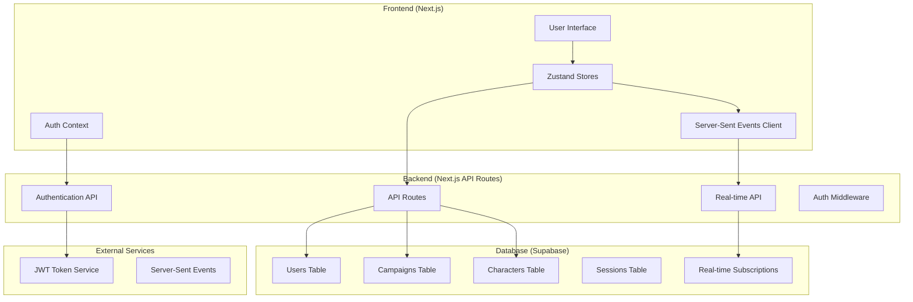

# RollKeeper Backend Integration & Real-Time Features Design

## 🎯 Overview

This document outlines the comprehensive backend integration for RollKeeper, transforming it from a client-side only app to a full-stack D&D companion with real-time multiplayer features, user authentication, and cloud synchronization.

## 🏗️ Architecture Overview

### Current State
- **Frontend-Only**: Next.js app with localStorage persistence
- **Character Management**: Local player store with JSON import/export
- **DM Tools**: Basic combat tracker with limited functionality
- **No Authentication**: No user accounts or cloud sync
- **No Real-Time**: No multiplayer features

### Target Architecture


## 🗄️ Database Schema Design

### Core Tables

#### Users Table
```sql
CREATE TABLE users (
  id UUID PRIMARY KEY DEFAULT gen_random_uuid(),
  email VARCHAR(255) UNIQUE NOT NULL,
  username VARCHAR(50) UNIQUE NOT NULL,
  password_hash VARCHAR(255) NOT NULL,
  display_name VARCHAR(100),
  avatar_url TEXT,
  is_dm BOOLEAN DEFAULT false,
  preferences JSONB DEFAULT '{}',
  created_at TIMESTAMP DEFAULT NOW(),
  updated_at TIMESTAMP DEFAULT NOW(),
  last_login TIMESTAMP
);
```

#### Campaigns Table
```sql
CREATE TABLE campaigns (
  id UUID PRIMARY KEY DEFAULT gen_random_uuid(),
  name VARCHAR(200) NOT NULL,
  description TEXT,
  dm_user_id UUID REFERENCES users(id) ON DELETE CASCADE,
  settings JSONB DEFAULT '{}',
  is_active BOOLEAN DEFAULT true,
  invite_code VARCHAR(10) UNIQUE,
  created_at TIMESTAMP DEFAULT NOW(),
  updated_at TIMESTAMP DEFAULT NOW()
);
```

#### Characters Table
```sql
CREATE TABLE characters (
  id UUID PRIMARY KEY DEFAULT gen_random_uuid(),
  name VARCHAR(100) NOT NULL,
  owner_user_id UUID REFERENCES users(id) ON DELETE CASCADE,
  campaign_id UUID REFERENCES campaigns(id) ON DELETE SET NULL,
  character_data JSONB NOT NULL,
  is_public BOOLEAN DEFAULT false,
  sync_status VARCHAR(20) DEFAULT 'synced',
  last_synced TIMESTAMP DEFAULT NOW(),
  created_at TIMESTAMP DEFAULT NOW(),
  updated_at TIMESTAMP DEFAULT NOW()
);
```

#### Campaign Members Table
```sql
CREATE TABLE campaign_members (
  id UUID PRIMARY KEY DEFAULT gen_random_uuid(),
  campaign_id UUID REFERENCES campaigns(id) ON DELETE CASCADE,
  user_id UUID REFERENCES users(id) ON DELETE CASCADE,
  character_id UUID REFERENCES characters(id) ON DELETE SET NULL,
  role VARCHAR(20) DEFAULT 'player', -- 'player', 'co_dm'
  joined_at TIMESTAMP DEFAULT NOW(),
  is_active BOOLEAN DEFAULT true,
  UNIQUE(campaign_id, user_id)
);
```

#### Real-Time Sessions Table
```sql
CREATE TABLE realtime_sessions (
  id UUID PRIMARY KEY DEFAULT gen_random_uuid(),
  campaign_id UUID REFERENCES campaigns(id) ON DELETE CASCADE,
  session_type VARCHAR(20) NOT NULL, -- 'combat', 'general'
  session_data JSONB DEFAULT '{}',
  is_active BOOLEAN DEFAULT true,
  created_at TIMESTAMP DEFAULT NOW(),
  updated_at TIMESTAMP DEFAULT NOW()
);
```

#### Character Updates Log Table
```sql
CREATE TABLE character_updates (
  id UUID PRIMARY KEY DEFAULT gen_random_uuid(),
  character_id UUID REFERENCES characters(id) ON DELETE CASCADE,
  campaign_id UUID REFERENCES campaigns(id) ON DELETE CASCADE,
  update_type VARCHAR(50) NOT NULL, -- 'hp_change', 'spell_slot_use', 'condition_add', etc.
  update_data JSONB NOT NULL,
  created_by UUID REFERENCES users(id),
  created_at TIMESTAMP DEFAULT NOW()
);
```

### Indexes for Performance
```sql
-- User lookups
CREATE INDEX idx_users_email ON users(email);
CREATE INDEX idx_users_username ON users(username);

-- Campaign queries
CREATE INDEX idx_campaigns_dm ON campaigns(dm_user_id);
CREATE INDEX idx_campaigns_active ON campaigns(is_active);

-- Character queries
CREATE INDEX idx_characters_owner ON characters(owner_user_id);
CREATE INDEX idx_characters_campaign ON characters(campaign_id);
CREATE INDEX idx_characters_sync ON characters(sync_status);

-- Campaign member queries
CREATE INDEX idx_campaign_members_campaign ON campaign_members(campaign_id);
CREATE INDEX idx_campaign_members_user ON campaign_members(user_id);

-- Real-time queries
CREATE INDEX idx_realtime_sessions_campaign ON realtime_sessions(campaign_id, is_active);
CREATE INDEX idx_character_updates_character ON character_updates(character_id);
CREATE INDEX idx_character_updates_campaign ON character_updates(campaign_id);
CREATE INDEX idx_character_updates_time ON character_updates(created_at);
```

## 🔐 Authentication System

### Custom JWT-Based Authentication

#### Why Custom Auth?
- **Simplicity**: Avoid complexity of third-party auth providers
- **Control**: Full control over user data and flows
- **Supabase Compatible**: Works well with Supabase RLS policies
- **Vercel Friendly**: No additional services required

#### Auth Flow
```typescript
// Registration Flow
POST /api/auth/register
{
  email: string,
  username: string, 
  password: string,
  displayName?: string
}

// Login Flow  
POST /api/auth/login
{
  email: string,
  password: string
}

// Response
{
  user: User,
  token: string,
  refreshToken: string
}

// Token Refresh
POST /api/auth/refresh
{
  refreshToken: string
}
```

#### JWT Token Structure
```typescript
interface JWTPayload {
  userId: string;
  email: string;
  username: string;
  isDM: boolean;
  iat: number;
  exp: number;
}
```

#### Auth Middleware
```typescript
// Protect API routes
export function withAuth(handler: NextApiHandler) {
  return async (req: NextApiRequest, res: NextApiResponse) => {
    const token = req.headers.authorization?.replace('Bearer ', '');
    
    if (!token) {
      return res.status(401).json({ error: 'No token provided' });
    }
    
    try {
      const payload = jwt.verify(token, process.env.JWT_SECRET!) as JWTPayload;
      req.user = payload;
      return handler(req, res);
    } catch (error) {
      return res.status(401).json({ error: 'Invalid token' });
    }
  };
}
```

## 🔄 Real-Time Synchronization

### Server-Sent Events Implementation

#### Why SSE over WebSockets?
- **Vercel Compatible**: Works out of the box on Vercel
- **Simpler Implementation**: Unidirectional data flow
- **Auto-Reconnection**: Built-in browser reconnection
- **HTTP/2 Friendly**: Better performance over HTTP/2

#### SSE Architecture
```typescript
// SSE Connection Endpoint
GET /api/realtime/connect?campaignId={id}&token={jwt}

// Event Types
interface RealtimeEvent {
  type: 'character_update' | 'combat_update' | 'sync_request';
  campaignId: string;
  characterId?: string;
  data: any;
  timestamp: number;
  userId: string;
}
```

#### Client-Side SSE Handler
```typescript
class RealtimeClient {
  private eventSource: EventSource | null = null;
  private reconnectAttempts = 0;
  private maxReconnectAttempts = 5;
  
  connect(campaignId: string, token: string) {
    const url = `/api/realtime/connect?campaignId=${campaignId}&token=${token}`;
    this.eventSource = new EventSource(url);
    
    this.eventSource.onmessage = (event) => {
      const data: RealtimeEvent = JSON.parse(event.data);
      this.handleRealtimeEvent(data);
    };
    
    this.eventSource.onerror = () => {
      this.handleReconnection();
    };
  }
  
  private handleRealtimeEvent(event: RealtimeEvent) {
    switch (event.type) {
      case 'character_update':
        // Update character in store
        break;
      case 'combat_update':
        // Update combat state
        break;
      case 'sync_request':
        // Trigger sync
        break;
    }
  }
}
```

### Sync Strategy

#### Optimistic Updates with Conflict Resolution
```typescript
interface SyncState {
  status: 'synced' | 'pending' | 'conflict' | 'error';
  lastSyncTime: number;
  pendingChanges: Change[];
  conflictData?: ConflictData;
}

interface Change {
  id: string;
  type: string;
  path: string;
  value: any;
  timestamp: number;
  userId: string;
}
```

#### Sync Button Implementation
```typescript
const SyncIndicator = () => {
  const { syncState, triggerSync } = useSyncStore();
  
  return (
    <button 
      onClick={triggerSync}
      className={`sync-button ${syncState.status}`}
    >
      {syncState.status === 'pending' && <Spinner />}
      {syncState.status === 'synced' && <CheckIcon />}
      {syncState.status === 'conflict' && <AlertIcon />}
      {syncState.status === 'error' && <ErrorIcon />}
      Sync ({syncState.pendingChanges.length})
    </button>
  );
};
```

## ⚔️ Enhanced Battle Tracker

### Compact Player Cards for DMs

#### Current Issues
- Cards too large for DM overview
- Missing essential combat info
- No real-time updates
- Limited resource tracking

#### New Compact Card Design
```typescript
interface CompactPlayerCard {
  // Essential Info (Always Visible)
  name: string;
  class: string;
  level: number;
  
  // Combat Stats (Prominent)
  hp: { current: number; max: number; temp: number };
  ac: { base: number; temp: number };
  initiative: number;
  
  // Action Economy (Visual Indicators)
  hasAction: boolean;
  hasBonusAction: boolean;
  hasReaction: boolean;
  hasMovement: boolean;
  
  // Resources (Collapsible)
  spellSlots: SpellSlotData;
  features: FeatureUsage[];
  conditions: ActiveCondition[];
  
  // Real-time Status
  isOnline: boolean;
  lastUpdate: number;
  syncStatus: 'synced' | 'pending' | 'conflict';
}
```

#### Card Layout (Compact Mode)
```tsx
const CompactPlayerCard = ({ player, isCurrentTurn }: Props) => {
  return (
    <div className={`compact-card ${isCurrentTurn ? 'current-turn' : ''}`}>
      {/* Header Row */}
      <div className="card-header">
        <div className="player-info">
          <h3>{player.name}</h3>
          <span className="class-level">{player.class} {player.level}</span>
        </div>
        <div className="sync-status">
          <SyncIndicator status={player.syncStatus} />
          <OnlineIndicator isOnline={player.isOnline} />
        </div>
      </div>
      
      {/* Combat Stats Row */}
      <div className="combat-stats">
        <HPBar 
          current={player.hp.current} 
          max={player.hp.max} 
          temp={player.hp.temp}
          onUpdate={handleHPUpdate}
        />
        <div className="ac-initiative">
          <span className="ac">AC {player.ac.base + player.ac.temp}</span>
          <span className="initiative">Init {player.initiative}</span>
        </div>
      </div>
      
      {/* Action Economy */}
      <div className="action-economy">
        <ActionIndicator type="action" available={player.hasAction} />
        <ActionIndicator type="bonus" available={player.hasBonusAction} />
        <ActionIndicator type="reaction" available={player.hasReaction} />
        <ActionIndicator type="movement" available={player.hasMovement} />
      </div>
      
      {/* Expandable Resources */}
      <Collapsible trigger="Resources">
        <SpellSlotTracker slots={player.spellSlots} compact />
        <FeatureTracker features={player.features} compact />
        <ConditionTracker conditions={player.conditions} compact />
      </Collapsible>
    </div>
  );
};
```

### Real-Time Combat Updates

#### Update Types
```typescript
type CombatUpdateType = 
  | 'hp_change'
  | 'spell_slot_use'
  | 'feature_use'
  | 'condition_add'
  | 'condition_remove'
  | 'action_use'
  | 'turn_end'
  | 'initiative_change';

interface CombatUpdate {
  type: CombatUpdateType;
  characterId: string;
  campaignId: string;
  data: any;
  source: 'player' | 'dm';
  timestamp: number;
}
```

#### Real-Time Update Flow
```typescript
// Player casts spell -> uses spell slot
const castSpell = async (spellLevel: number) => {
  // Optimistic update
  updateSpellSlotLocally(spellLevel);
  
  // Send to backend
  const update: CombatUpdate = {
    type: 'spell_slot_use',
    characterId: character.id,
    campaignId: currentCampaign.id,
    data: { spellLevel, slotsRemaining: newSlotCount },
    source: 'player',
    timestamp: Date.now()
  };
  
  await sendCombatUpdate(update);
  
  // SSE will notify DM immediately
};

// DM receives update via SSE
const handleCombatUpdate = (update: CombatUpdate) => {
  if (update.type === 'spell_slot_use') {
    updatePlayerCardInCombatTracker(update.characterId, {
      spellSlots: update.data.slotsRemaining
    });
    
    // Show notification
    showNotification(`${playerName} used a level ${update.data.spellLevel} spell slot`);
  }
};
```

## 🚀 Implementation Phases

### Phase 1: Backend Foundation (Week 1)
- [ ] Set up Supabase project and database schema
- [ ] Implement custom authentication system
- [ ] Create basic API routes for users and campaigns
- [ ] Add JWT middleware and auth context

### Phase 2: Character Sync System (Week 2)
- [ ] Migrate character storage to database
- [ ] Implement character CRUD operations
- [ ] Add sync status tracking
- [ ] Create migration tool for existing localStorage data

### Phase 3: Real-Time Infrastructure (Week 2-3)
- [ ] Implement Server-Sent Events endpoints
- [ ] Create real-time client connection manager
- [ ] Add campaign membership and invitation system
- [ ] Implement basic real-time character updates

### Phase 4: Enhanced Battle Tracker (Week 3-4)
- [ ] Redesign combat participant cards (compact mode)
- [ ] Add real-time combat update system
- [ ] Implement resource tracking (spell slots, features)
- [ ] Add condition and status effect tracking

### Phase 5: Advanced Features (Week 4-5)
- [ ] Add conflict resolution for simultaneous updates
- [ ] Implement offline support with sync queue
- [ ] Add DM override capabilities
- [ ] Create comprehensive sync indicators and controls

### Phase 6: Polish & Testing (Week 5-6)
- [ ] Performance optimization
- [ ] Comprehensive testing
- [ ] User experience improvements
- [ ] Documentation and deployment

## 🔧 Technical Implementation Details

### Environment Variables
```env
# Database
SUPABASE_URL=your_supabase_url
SUPABASE_ANON_KEY=your_supabase_anon_key
SUPABASE_SERVICE_ROLE_KEY=your_service_role_key

# Authentication
JWT_SECRET=your_jwt_secret_key
JWT_REFRESH_SECRET=your_refresh_secret_key

# Real-time
REALTIME_SECRET=your_realtime_secret
```

### Package Dependencies to Add
```json
{
  "@supabase/supabase-js": "^2.39.0",
  "jsonwebtoken": "^9.0.2",
  "bcryptjs": "^2.4.3",
  "zod": "^3.22.4"
}
```

### File Structure Changes
```
src/
├── app/
│   ├── api/
│   │   ├── auth/
│   │   │   ├── login/route.ts
│   │   │   ├── register/route.ts
│   │   │   └── refresh/route.ts
│   │   ├── campaigns/
│   │   │   ├── route.ts
│   │   │   └── [id]/
│   │   │       ├── route.ts
│   │   │       ├── members/route.ts
│   │   │       └── characters/route.ts
│   │   ├── characters/
│   │   │   ├── route.ts
│   │   │   └── [id]/route.ts
│   │   └── realtime/
│   │       ├── connect/route.ts
│   │       └── update/route.ts
├── lib/
│   ├── supabase.ts
│   ├── auth.ts
│   ├── realtime.ts
│   └── sync.ts
├── contexts/
│   ├── AuthContext.tsx
│   └── RealtimeContext.tsx
└── hooks/
    ├── useAuth.ts
    ├── useRealtime.ts
    └── useSync.ts
```

## 🎯 Success Metrics

### Performance Goals
- **Real-time latency**: < 500ms for combat updates
- **Sync reliability**: 99.9% successful sync operations
- **Offline capability**: 24+ hours of offline operation
- **Concurrent users**: Support 10+ players per campaign

### User Experience Goals
- **Seamless sync**: Users rarely need to manually sync
- **Conflict resolution**: Clear UI for handling conflicts
- **Real-time feedback**: Immediate visual feedback for all actions
- **Mobile optimization**: Full functionality on mobile devices

This comprehensive design provides a solid foundation for transforming RollKeeper into a full-featured, real-time multiplayer D&D companion while maintaining compatibility with existing features and ensuring a smooth migration path for current users.
