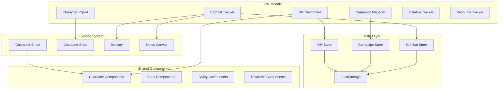
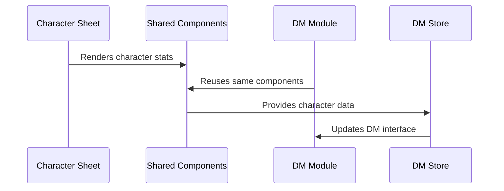
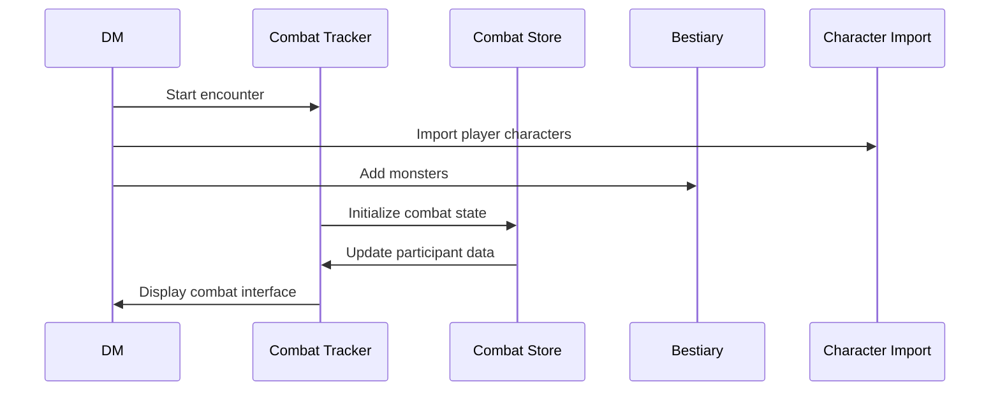

# DM Toolset Architecture

## 🏗️ System Architecture Overview

The DM Toolset is designed as a modular extension to RollKeeper that reuses existing infrastructure while providing DM-specific functionality. The architecture prioritizes non-breaking integration and component reusability.



## 🎯 Core Design Principles

### 1. Non-Breaking Integration
- **Zero Impact**: Existing character sheet functionality remains unchanged
- **Additive Architecture**: New features extend rather than modify existing code
- **Shared Components**: Reuse existing UI components through extraction
- **Data Compatibility**: Maintain existing data formats and storage patterns

### 2. Modular Design
- **Separation of Concerns**: DM functionality isolated in dedicated modules
- **Composable Components**: Small, focused components that can be combined
- **State Isolation**: DM state management separate from character state
- **Feature Toggles**: Ability to enable/disable DM features independently

### 3. Reusability
- **Component Extraction**: Convert existing components to reusable shared components
- **Data Model Consistency**: Use same character data structures in both contexts
- **Style Inheritance**: Maintain visual consistency across player and DM views
- **Interaction Patterns**: Familiar UI patterns from existing character sheet

## 📁 Directory Structure

```
src/
├── app/
│   ├── dm/                          # DM Module Routes
│   │   ├── page.tsx                 # DM Dashboard
│   │   ├── layout.tsx               # DM Layout with Navigation
│   │   ├── campaigns/
│   │   │   ├── page.tsx             # Campaign List
│   │   │   ├── new/
│   │   │   │   └── page.tsx         # Create Campaign
│   │   │   └── [campaignId]/
│   │   │       ├── page.tsx         # Campaign Dashboard
│   │   │       ├── characters/
│   │   │       │   ├── page.tsx     # Character Management
│   │   │       │   └── import/
│   │   │       │       └── page.tsx # Character Import
│   │   │       ├── combat/
│   │   │       │   ├── page.tsx     # Combat Tracker
│   │   │       │   └── [encounterId]/
│   │   │       │       └── page.tsx # Specific Encounter
│   │   │       ├── notes/
│   │   │       │   └── page.tsx     # Campaign Notes
│   │   │       └── encounters/
│   │   │           ├── page.tsx     # Encounter List
│   │   │           └── new/
│   │   │               └── page.tsx # Create Encounter
│   │   └── settings/
│   │       └── page.tsx             # DM Settings
│   └── [existing routes...]
├── components/
│   ├── dm/                          # DM-Specific Components
│   │   ├── CombatTracker/
│   │   │   ├── CombatCanvas.tsx
│   │   │   ├── CombatParticipant.tsx
│   │   │   ├── TurnTracker.tsx
│   │   │   └── index.ts
│   │   ├── CampaignManager/
│   │   │   ├── CampaignCard.tsx
│   │   │   ├── CampaignForm.tsx
│   │   │   ├── CampaignDashboard.tsx
│   │   │   └── index.ts
│   │   ├── CharacterManager/
│   │   │   ├── CharacterPool.tsx
│   │   │   ├── CharacterImport.tsx
│   │   │   ├── CharacterSync.tsx
│   │   │   └── index.ts
│   │   ├── InitiativeTracker/
│   │   │   ├── InitiativeList.tsx
│   │   │   ├── InitiativeRoller.tsx
│   │   │   ├── TurnIndicator.tsx
│   │   │   └── index.ts
│   │   ├── ResourceTracker/
│   │   │   ├── HPTracker.tsx
│   │   │   ├── SpellSlotTracker.tsx
│   │   │   ├── ConditionTracker.tsx
│   │   │   └── index.ts
│   │   └── Navigation/
│   │       ├── DMSidebar.tsx
│   │       ├── CampaignNav.tsx
│   │       └── index.ts
│   ├── shared/                      # Extracted Reusable Components
│   │   ├── character/
│   │   │   ├── CharacterStatsDisplay.tsx
│   │   │   ├── CharacterHeader.tsx
│   │   │   ├── CharacterAvatar.tsx
│   │   │   └── index.ts
│   │   ├── stats/
│   │   │   ├── AbilityScoreDisplay.tsx
│   │   │   ├── SkillDisplay.tsx
│   │   │   ├── SavingThrowDisplay.tsx
│   │   │   └── index.ts
│   │   ├── combat/
│   │   │   ├── HitPointTracker.tsx
│   │   │   ├── ArmorClassDisplay.tsx
│   │   │   ├── InitiativeDisplay.tsx
│   │   │   └── index.ts
│   │   ├── spells/
│   │   │   ├── SpellSlotDisplay.tsx
│   │   │   ├── SpellListDisplay.tsx
│   │   │   ├── ConcentrationDisplay.tsx
│   │   │   └── index.ts
│   │   └── conditions/
│   │       ├── ConditionBadge.tsx
│   │       ├── ConditionList.tsx
│   │       └── index.ts
│   └── [existing components...]
├── store/
│   ├── dmStore.ts                   # DM Module State
│   ├── campaignStore.ts             # Campaign Management
│   ├── combatStore.ts               # Combat Encounters
│   └── [existing stores...]
├── types/
│   ├── dm.ts                        # DM-specific types
│   ├── campaign.ts                  # Campaign data structures
│   ├── combat.ts                    # Combat encounter types
│   └── [existing types...]
└── utils/
    ├── dm/
    │   ├── campaignUtils.ts
    │   ├── combatUtils.ts
    │   ├── characterImport.ts
    │   └── initiativeUtils.ts
    └── [existing utils...]
```

## 🔄 Component Interaction Flow

### Character Sheet to DM Module


### Combat Tracker Workflow


## 🏪 State Management Architecture

### Store Hierarchy
```typescript
// Global State Structure
interface RootState {
  // Existing stores (unchanged)
  character: CharacterStore;
  
  // New DM stores
  dm: DMStore;
  campaigns: CampaignStore;
  combat: CombatStore;
}
```

### Data Flow Patterns

#### 1. Character Data Synchronization
- **Source of Truth**: Player character sheet remains authoritative
- **DM Copy**: DM module maintains cached copies with sync timestamps
- **Conflict Resolution**: Clear precedence rules for data conflicts
- **Real-time Updates**: Optional sync between player and DM views

#### 2. Campaign Persistence
- **LocalStorage**: Campaign data persisted locally
- **Import/Export**: JSON-based campaign sharing
- **Versioning**: Data migration for schema changes
- **Backup**: Automatic backup of campaign data

#### 3. Combat State Management
- **Session-based**: Combat state cleared between encounters
- **Undo/Redo**: Action history for combat decisions
- **Auto-save**: Continuous save of combat progress
- **Recovery**: Restore interrupted combat sessions

## 🔌 Integration Points

### 1. Existing Character Sheet
```typescript
// Extract reusable components without breaking existing usage
// Before: Direct component usage in character sheet
<HitPointManager character={character} />

// After: Shared component used in both contexts
<HitPointTracker 
  hitPoints={character.hitPoints}
  onUpdate={updateHitPoints}
  readonly={false}
/>
```

### 2. Canvas System Reuse
```typescript
// Extend existing notes canvas for combat tracking
interface CombatCanvasProps extends NotesCanvasProps {
  participants: CombatParticipant[];
  onParticipantMove: (id: string, position: Position) => void;
  showGrid?: boolean;
  turnOrder: string[];
}
```

### 3. Bestiary Integration
```typescript
// Direct integration with existing monster data
const addMonsterToCombat = (monster: ProcessedMonster) => {
  const participant: CombatParticipant = {
    id: generateId(),
    type: 'enemy',
    name: monster.name,
    monsterData: monster,
    combatStats: initializeCombatStats(monster),
    // ... other properties
  };
  combatStore.addParticipant(participant);
};
```

## 🎯 Performance Considerations

### 1. Component Optimization
- **Memo Optimization**: Prevent unnecessary re-renders
- **Lazy Loading**: Load DM components only when needed
- **Virtual Scrolling**: Handle large participant lists efficiently
- **Canvas Performance**: Optimize React Flow rendering

### 2. State Management
- **Selective Updates**: Update only changed combat participants
- **Computed Values**: Cache expensive calculations
- **Debounced Saves**: Batch state persistence operations
- **Memory Management**: Clean up unused combat data

### 3. Data Loading
- **Progressive Loading**: Load campaign data incrementally
- **Background Sync**: Sync character data in background
- **Caching Strategy**: Cache frequently accessed data
- **Lazy Imports**: Load character data only when needed

## 🛡️ Error Handling & Recovery

### 1. Data Integrity
- **Validation**: Validate imported character data
- **Schema Migration**: Handle data format changes
- **Fallback Values**: Provide defaults for missing data
- **Corruption Recovery**: Detect and recover from corrupt data

### 2. Combat State Recovery
- **Auto-save**: Continuous backup of combat state
- **Session Recovery**: Restore interrupted sessions
- **Undo System**: Allow reverting combat actions
- **State Validation**: Verify combat state consistency

### 3. Character Sync Issues
- **Conflict Detection**: Identify character data conflicts
- **Resolution UI**: Present conflict resolution options
- **Sync Status**: Show character synchronization state
- **Manual Override**: Allow manual conflict resolution

---

This architecture ensures the DM Toolset integrates seamlessly with RollKeeper while providing powerful campaign management capabilities.
