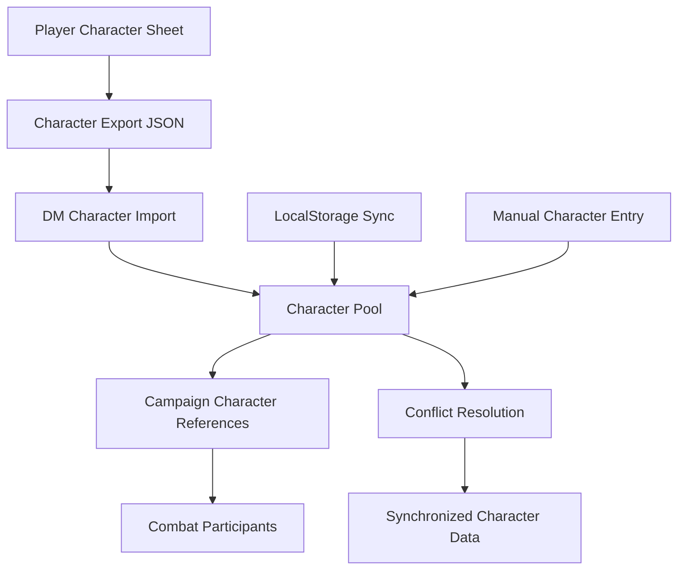

# Character Import & Management System

## 🎯 Overview

The Character Import system enables DMs to manage player characters across campaigns and sessions. It provides seamless integration between player character sheets and DM tools while maintaining data integrity and handling synchronization conflicts.

## 🔄 Import Architecture

### Data Flow Diagram


### Import Sources
1. **JSON File Import**: Standard character export files
2. **LocalStorage Sync**: Direct import from main character sheet
3. **Manual Entry**: Quick character creation for NPCs/guests
4. **Bulk Import**: Multiple characters at once
5. **URL Import**: Share characters via links (future)

## 📁 Data Structures

### Character Import Types
```typescript
// Character import metadata
interface CharacterImportSource {
  type: 'json' | 'localStorage' | 'manual' | 'url';
  timestamp: Date;
  originalId?: string;
  fileName?: string;
  version: string;
  hash: string; // For change detection
}

// Character reference for DM use
interface PlayerCharacterReference {
  // Identity
  id: string;                        // Unique DM reference ID
  characterId: string;               // Original character sheet ID
  campaignId: string;                // Associated campaign
  
  // Basic info (cached for quick access)
  characterName: string;
  playerName: string;
  class: string;
  level: number;
  race: string;
  
  // Import metadata
  importSource: CharacterImportSource;
  importedAt: Date;
  lastSynced: Date;
  syncStatus: CharacterSyncStatus;
  
  // DM management
  isActive: boolean;                 // Currently in campaign
  isVisible: boolean;                // Visible to other players
  dmNotes: string;                   // Private DM notes
  customName?: string;               // DM override for character name
  
  // Cached data (for offline access)
  characterData: CharacterState;
  lastKnownHash: string;
  
  // Combat tracking
  combatHistory: CombatParticipationRecord[];
  lastCombatStats?: CombatStats;
}

type CharacterSyncStatus = 
  | 'synced'      // Up to date
  | 'outdated'    // Character has been updated since last sync
  | 'conflict'    // Conflicting changes detected
  | 'manual'      // Manual override, don't sync
  | 'error';      // Sync failed
```

### Character Pool Management
```typescript
interface CharacterPool {
  characters: Map<string, PlayerCharacterReference>;
  campaigns: Map<string, string[]>; // campaign -> character IDs
  syncSettings: CharacterSyncSettings;
  lastSync: Date;
}

interface CharacterSyncSettings {
  autoSync: boolean;
  syncFrequency: 'never' | 'on_load' | 'on_change' | 'real_time';
  conflictResolution: 'dm_wins' | 'player_wins' | 'ask' | 'merge';
  syncOnCombatStart: boolean;
  backupBeforeSync: boolean;
}
```

## 📥 Import System Implementation

### Character Import Component
```typescript
// src/components/dm/CharacterManager/CharacterImport.tsx
interface CharacterImportProps {
  campaignId: string;
  onImportComplete?: (characters: PlayerCharacterReference[]) => void;
  allowBulkImport?: boolean;
}

export function CharacterImport({
  campaignId,
  onImportComplete,
  allowBulkImport = true
}: CharacterImportProps) {
  const [importMethod, setImportMethod] = useState<ImportMethod>('file');
  const [importedCharacters, setImportedCharacters] = useState<CharacterState[]>([]);
  const [validationErrors, setValidationErrors] = useState<ValidationError[]>([]);
  const [isProcessing, setIsProcessing] = useState(false);
  
  const handleFileImport = useCallback(async (files: FileList) => {
    setIsProcessing(true);
    const characters: CharacterState[] = [];
    const errors: ValidationError[] = [];
    
    for (const file of Array.from(files)) {
      try {
        const content = await readFileAsText(file);
        const characterData = JSON.parse(content);
        
        // Validate character data
        const validation = validateCharacterData(characterData);
        if (validation.isValid) {
          characters.push(characterData as CharacterState);
        } else {
          errors.push({
            fileName: file.name,
            errors: validation.errors
          });
        }
      } catch (error) {
        errors.push({
          fileName: file.name,
          errors: [`Failed to parse JSON: ${error.message}`]
        });
      }
    }
    
    setImportedCharacters(characters);
    setValidationErrors(errors);
    setIsProcessing(false);
  }, []);
  
  const handleLocalStorageSync = useCallback(async () => {
    const localCharacter = localStorage.getItem('character-store');
    if (localCharacter) {
      try {
        const parsed = JSON.parse(localCharacter);
        const characterData = parsed.state?.character;
        
        if (characterData) {
          const validation = validateCharacterData(characterData);
          if (validation.isValid) {
            setImportedCharacters([characterData]);
          } else {
            setValidationErrors([{
              fileName: 'Local Storage',
              errors: validation.errors
            }]);
          }
        }
      } catch (error) {
        setValidationErrors([{
          fileName: 'Local Storage',
          errors: [`Failed to parse local storage data: ${error.message}`]
        }]);
      }
    }
  }, []);
  
  return (
    <div className="character-import">
      <div className="import-methods">
        <TabGroup value={importMethod} onValueChange={setImportMethod}>
          <TabsList>
            <TabsTrigger value="file">JSON Files</TabsTrigger>
            <TabsTrigger value="localStorage">Local Storage</TabsTrigger>
            <TabsTrigger value="manual">Manual Entry</TabsTrigger>
          </TabsList>
          
          <TabsContent value="file">
            <FileDropZone
              onDrop={handleFileImport}
              accept=".json"
              multiple={allowBulkImport}
              loading={isProcessing}
            />
          </TabsContent>
          
          <TabsContent value="localStorage">
            <LocalStorageImport
              onImport={handleLocalStorageSync}
              loading={isProcessing}
            />
          </TabsContent>
          
          <TabsContent value="manual">
            <ManualCharacterEntry
              onCharacterCreated={(character) => setImportedCharacters([character])}
            />
          </TabsContent>
        </TabGroup>
      </div>
      
      {/* Validation Errors */}
      {validationErrors.length > 0 && (
        <ImportErrorDisplay errors={validationErrors} />
      )}
      
      {/* Preview Imported Characters */}
      {importedCharacters.length > 0 && (
        <ImportPreview
          characters={importedCharacters}
          campaignId={campaignId}
          onConfirmImport={(characters) => {
            importCharactersToCampaign(characters, campaignId);
            onImportComplete?.(characters);
          }}
        />
      )}
    </div>
  );
}
```

### Character Validation
```typescript
// src/utils/dm/characterValidation.ts
interface ValidationResult {
  isValid: boolean;
  errors: string[];
  warnings: string[];
}

export function validateCharacterData(data: unknown): ValidationResult {
  const errors: string[] = [];
  const warnings: string[] = [];
  
  // Basic structure validation
  if (!data || typeof data !== 'object') {
    return { isValid: false, errors: ['Invalid character data structure'], warnings: [] };
  }
  
  const character = data as Record<string, unknown>;
  
  // Required fields
  const requiredFields = ['name', 'class', 'level', 'abilities', 'hitPoints'];
  for (const field of requiredFields) {
    if (!(field in character)) {
      errors.push(`Missing required field: ${field}`);
    }
  }
  
  // Validate specific fields
  if (character.name && typeof character.name !== 'string') {
    errors.push('Character name must be a string');
  }
  
  if (character.level && (typeof character.level !== 'number' || character.level < 1 || character.level > 20)) {
    errors.push('Character level must be a number between 1 and 20');
  }
  
  // Validate abilities
  if (character.abilities) {
    const abilities = character.abilities as Record<string, unknown>;
    const requiredAbilities = ['strength', 'dexterity', 'constitution', 'intelligence', 'wisdom', 'charisma'];
    
    for (const ability of requiredAbilities) {
      if (!(ability in abilities)) {
        errors.push(`Missing ability score: ${ability}`);
      } else if (typeof abilities[ability] !== 'number') {
        errors.push(`Ability score ${ability} must be a number`);
      }
    }
  }
  
  // Validate hit points
  if (character.hitPoints) {
    const hp = character.hitPoints as Record<string, unknown>;
    if (typeof hp.current !== 'number' || typeof hp.max !== 'number') {
      errors.push('Hit points current and max must be numbers');
    }
  }
  
  // Check for deprecated fields (warnings)
  const deprecatedFields = ['oldSpellSystem', 'legacyInventory'];
  for (const field of deprecatedFields) {
    if (field in character) {
      warnings.push(`Deprecated field detected: ${field}. Will be migrated automatically.`);
    }
  }
  
  return {
    isValid: errors.length === 0,
    errors,
    warnings
  };
}
```

## 🔄 Synchronization System

### Character Sync Manager
```typescript
// src/utils/dm/characterSync.ts
export class CharacterSyncManager {
  private static generateCharacterHash(character: CharacterState): string {
    // Generate hash of important character data for change detection
    const hashData = {
      level: character.level,
      hitPoints: character.hitPoints,
      abilities: character.abilities,
      spellSlots: character.spellSlots,
      // Add other critical fields
    };
    return btoa(JSON.stringify(hashData));
  }
  
  static async syncCharacter(
    characterRef: PlayerCharacterReference,
    settings: CharacterSyncSettings
  ): Promise<SyncResult> {
    try {
      // Get current character data from localStorage
      const currentData = await this.fetchCurrentCharacterData(characterRef.characterId);
      if (!currentData) {
        return { success: false, error: 'Character not found in localStorage' };
      }
      
      // Check for changes
      const currentHash = this.generateCharacterHash(currentData);
      const hasChanged = currentHash !== characterRef.lastKnownHash;
      
      if (!hasChanged && characterRef.syncStatus === 'synced') {
        return { success: true, action: 'no_change' };
      }
      
      // Detect conflicts
      const hasConflict = this.detectConflict(characterRef, currentData);
      if (hasConflict) {
        return this.handleConflict(characterRef, currentData, settings);
      }
      
      // Perform sync
      const updatedRef: PlayerCharacterReference = {
        ...characterRef,
        characterData: currentData,
        lastKnownHash: currentHash,
        lastSynced: new Date(),
        syncStatus: 'synced'
      };
      
      await this.saveCharacterReference(updatedRef);
      
      return { 
        success: true, 
        action: 'updated',
        updatedCharacter: updatedRef
      };
    } catch (error) {
      return { 
        success: false, 
        error: `Sync failed: ${error.message}`,
        characterRef: { ...characterRef, syncStatus: 'error' }
      };
    }
  }
  
  private static detectConflict(
    characterRef: PlayerCharacterReference,
    currentData: CharacterState
  ): boolean {
    // Check if both DM and player have made changes since last sync
    const lastSync = characterRef.lastSynced;
    const dmLastModified = characterRef.combatHistory.length > 0 
      ? Math.max(...characterRef.combatHistory.map(h => h.joinedAt.getTime()))
      : 0;
    
    // Simple conflict detection - in real implementation, this would be more sophisticated
    return dmLastModified > lastSync.getTime() && 
           currentData.hitPoints.current !== characterRef.characterData.hitPoints.current;
  }
  
  private static async handleConflict(
    characterRef: PlayerCharacterReference,
    currentData: CharacterState,
    settings: CharacterSyncSettings
  ): Promise<SyncResult> {
    switch (settings.conflictResolution) {
      case 'dm_wins':
        // Keep DM version, don't sync
        return { success: true, action: 'dm_override' };
        
      case 'player_wins':
        // Accept player version
        return this.forceSyncFromPlayer(characterRef, currentData);
        
      case 'ask':
        // Mark as conflict for manual resolution
        return {
          success: false,
          error: 'Conflict detected',
          action: 'conflict',
          characterRef: { ...characterRef, syncStatus: 'conflict' }
        };
        
      case 'merge':
        // Attempt automatic merge
        return this.attemptMerge(characterRef, currentData);
        
      default:
        return { success: false, error: 'Unknown conflict resolution strategy' };
    }
  }
  
  private static async attemptMerge(
    characterRef: PlayerCharacterReference,
    currentData: CharacterState
  ): Promise<SyncResult> {
    // Smart merge logic - prioritize certain fields
    const mergedData: CharacterState = {
      ...currentData, // Start with player data
      
      // Preserve DM-managed combat state if in combat
      hitPoints: {
        ...currentData.hitPoints,
        // Keep DM's current HP if lower (damage taken in combat)
        current: Math.min(
          currentData.hitPoints.current,
          characterRef.characterData.hitPoints.current
        )
      },
      
      // Preserve spell slot usage from combat
      spellSlots: this.mergeSpellSlots(
        currentData.spellSlots,
        characterRef.characterData.spellSlots
      ),
      
      // Add any DM-applied conditions that are still active
      // This would need more sophisticated implementation
    };
    
    const mergedRef: PlayerCharacterReference = {
      ...characterRef,
      characterData: mergedData,
      lastKnownHash: this.generateCharacterHash(mergedData),
      lastSynced: new Date(),
      syncStatus: 'synced'
    };
    
    await this.saveCharacterReference(mergedRef);
    
    return {
      success: true,
      action: 'merged',
      updatedCharacter: mergedRef
    };
  }
}

interface SyncResult {
  success: boolean;
  action?: 'no_change' | 'updated' | 'conflict' | 'dm_override' | 'merged';
  error?: string;
  updatedCharacter?: PlayerCharacterReference;
  characterRef?: PlayerCharacterReference;
}
```

### Conflict Resolution UI
```typescript
// src/components/dm/CharacterManager/ConflictResolution.tsx
interface ConflictResolutionProps {
  characterRef: PlayerCharacterReference;
  currentData: CharacterState;
  onResolve: (resolution: ConflictResolution) => void;
  onCancel: () => void;
}

interface ConflictResolution {
  action: 'use_dm' | 'use_player' | 'merge' | 'manual';
  mergedData?: CharacterState;
}

export function ConflictResolution({
  characterRef,
  currentData,
  onResolve,
  onCancel
}: ConflictResolutionProps) {
  const [selectedAction, setSelectedAction] = useState<ConflictResolution['action']>('merge');
  const [mergedData, setMergedData] = useState<CharacterState | null>(null);
  
  // Show field-by-field comparison
  const conflicts = detectFieldConflicts(characterRef.characterData, currentData);
  
  return (
    <div className="conflict-resolution-modal">
      <div className="modal-header">
        <h2>Character Data Conflict</h2>
        <p>
          The character "{characterRef.characterName}" has been modified both in the DM 
          interface and by the player. Please choose how to resolve this conflict.
        </p>
      </div>
      
      <div className="conflict-details">
        <div className="data-comparison">
          <div className="dm-version">
            <h3>DM Version (Last Sync: {formatDate(characterRef.lastSynced)})</h3>
            <CharacterDataPreview character={characterRef.characterData} />
          </div>
          
          <div className="player-version">
            <h3>Player Version (Current)</h3>
            <CharacterDataPreview character={currentData} />
          </div>
        </div>
        
        <div className="conflict-fields">
          <h3>Conflicting Fields</h3>
          {conflicts.map(conflict => (
            <ConflictField
              key={conflict.field}
              conflict={conflict}
              onFieldResolve={(field, value) => {
                // Handle individual field resolution for manual merge
              }}
            />
          ))}
        </div>
      </div>
      
      <div className="resolution-options">
        <RadioGroup value={selectedAction} onValueChange={setSelectedAction}>
          <RadioGroupItem value="use_dm">
            Use DM Version (Keep combat changes, ignore player updates)
          </RadioGroupItem>
          <RadioGroupItem value="use_player">
            Use Player Version (Accept all player changes, lose combat changes)
          </RadioGroupItem>
          <RadioGroupItem value="merge">
            Smart Merge (Combine both versions intelligently)
          </RadioGroupItem>
          <RadioGroupItem value="manual">
            Manual Merge (Choose field by field)
          </RadioGroupItem>
        </RadioGroup>
      </div>
      
      {selectedAction === 'manual' && (
        <ManualMergeInterface
          dmData={characterRef.characterData}
          playerData={currentData}
          onMergedDataChange={setMergedData}
        />
      )}
      
      <div className="modal-actions">
        <Button
          onClick={() => onResolve({
            action: selectedAction,
            mergedData: mergedData || undefined
          })}
        >
          Resolve Conflict
        </Button>
        <Button variant="outline" onClick={onCancel}>
          Cancel
        </Button>
      </div>
    </div>
  );
}
```

## 🎯 Character Pool Management

### Character Pool Component
```typescript
// src/components/dm/CharacterManager/CharacterPool.tsx
export function CharacterPool({ campaignId }: { campaignId: string }) {
  const { characters, isLoading, syncAll, removeCharacter } = useCharacterPool(campaignId);
  const [selectedCharacters, setSelectedCharacters] = useState<string[]>([]);
  const [syncSettings, setSyncSettings] = useState<CharacterSyncSettings>(defaultSyncSettings);
  
  return (
    <div className="character-pool">
      <div className="pool-header">
        <div className="pool-actions">
          <Button onClick={syncAll} disabled={isLoading}>
            Sync All Characters
          </Button>
          <CharacterPoolSettings
            settings={syncSettings}
            onSettingsChange={setSyncSettings}
          />
        </div>
        
        <div className="pool-stats">
          <span className="character-count">{characters.length} Characters</span>
          <span className="sync-status">
            {characters.filter(c => c.syncStatus === 'synced').length} Synced
          </span>
        </div>
      </div>
      
      <div className="character-grid">
        {characters.map(character => (
          <CharacterPoolCard
            key={character.id}
            character={character}
            selected={selectedCharacters.includes(character.id)}
            onSelect={(selected) => {
              if (selected) {
                setSelectedCharacters(prev => [...prev, character.id]);
              } else {
                setSelectedCharacters(prev => prev.filter(id => id !== character.id));
              }
            }}
            onSync={() => syncCharacter(character.id)}
            onRemove={() => removeCharacter(character.id)}
          />
        ))}
      </div>
      
      {selectedCharacters.length > 0 && (
        <BulkActions
          selectedCharacters={selectedCharacters}
          onBulkSync={() => syncCharacters(selectedCharacters)}
          onBulkRemove={() => removeCharacters(selectedCharacters)}
          onBulkAddToCombat={() => addCharactersToCombat(selectedCharacters)}
        />
      )}
    </div>
  );
}
```

### Character Pool Card
```typescript
// src/components/dm/CharacterManager/CharacterPoolCard.tsx
export function CharacterPoolCard({
  character,
  selected,
  onSelect,
  onSync,
  onRemove
}: CharacterPoolCardProps) {
  const getSyncStatusColor = (status: CharacterSyncStatus) => {
    switch (status) {
      case 'synced': return 'text-green-600';
      case 'outdated': return 'text-yellow-600';
      case 'conflict': return 'text-red-600';
      case 'manual': return 'text-blue-600';
      case 'error': return 'text-red-800';
      default: return 'text-gray-600';
    }
  };
  
  return (
    <div className={cn("character-pool-card", { selected })}>
      <div className="card-header">
        <Checkbox checked={selected} onCheckedChange={onSelect} />
        <div className="character-info">
          <h3 className="character-name">{character.characterName}</h3>
          <p className="character-details">
            Level {character.level} {character.class} ({character.playerName})
          </p>
        </div>
        <Badge className={getSyncStatusColor(character.syncStatus)}>
          {character.syncStatus}
        </Badge>
      </div>
      
      <div className="card-body">
        <div className="character-stats">
          <div className="hp-display">
            HP: {character.characterData.hitPoints.current}/{character.characterData.hitPoints.max}
          </div>
          <div className="ac-display">
            AC: {character.characterData.armorClass}
          </div>
        </div>
        
        <div className="sync-info">
          <span className="last-sync">
            Last Sync: {formatRelativeTime(character.lastSynced)}
          </span>
          {character.syncStatus !== 'synced' && (
            <Button size="sm" onClick={onSync}>
              Sync Now
            </Button>
          )}
        </div>
      </div>
      
      <div className="card-actions">
        <DropdownMenu>
          <DropdownMenuTrigger asChild>
            <Button variant="ghost" size="sm">
              <MoreVertical size={16} />
            </Button>
          </DropdownMenuTrigger>
          <DropdownMenuContent>
            <DropdownMenuItem onClick={() => viewCharacterDetails(character)}>
              View Details
            </DropdownMenuItem>
            <DropdownMenuItem onClick={() => addToCombat(character)}>
              Add to Combat
            </DropdownMenuItem>
            <DropdownMenuItem onClick={() => exportCharacter(character)}>
              Export Character
            </DropdownMenuItem>
            <DropdownMenuSeparator />
            <DropdownMenuItem onClick={onRemove} className="text-red-600">
              Remove from Pool
            </DropdownMenuItem>
          </DropdownMenuContent>
        </DropdownMenu>
      </div>
    </div>
  );
}
```

---

This character import and management system provides comprehensive tools for DMs to work with player characters while maintaining data integrity and providing clear conflict resolution workflows.
