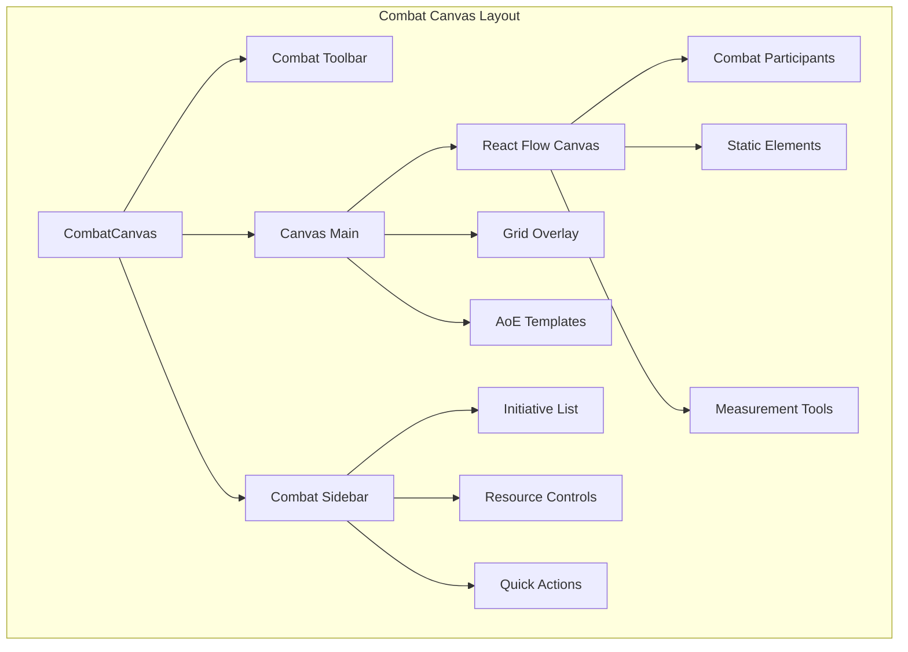

# Combat Tracker Design & Implementation

## 🎯 Overview

The Combat Tracker is the centerpiece of the DM Toolset, providing a visual, interactive canvas for managing D&D combat encounters. It builds upon the existing React Flow notes canvas while adding combat-specific functionality like initiative tracking, resource management, and tactical positioning.

## 🗺️ Canvas Architecture

### Building on Existing Foundation
The combat tracker extends the proven notes canvas system:

```typescript
// Existing notes canvas components
- NotesCanvas.tsx          → CombatCanvas.tsx
- NoteNode.tsx            → CombatParticipant.tsx  
- NotesCanvasFallback.tsx → CombatCanvasFallback.tsx
```

### Canvas Layout Structure


## 🎭 Combat Participants

### Participant Token Design
Each participant is represented as a draggable token on the canvas:

```typescript
interface CombatParticipantNode {
  id: string;
  type: 'combatParticipant';
  position: Position;
  data: CombatParticipantData;
}

interface CombatParticipantData {
  participant: CombatParticipant;
  isCurrentTurn: boolean;
  isSelected: boolean;
  onUpdateStats: (stats: Partial<CombatStats>) => void;
  onAddCondition: (condition: ActiveCondition) => void;
  onContextMenu: (action: string) => void;
}
```

### Token Visual States
```typescript
// Token appearance based on status
const getTokenStyle = (participant: CombatParticipant) => {
  const baseStyle = "combat-token";
  const statusStyles = [];
  
  // Health status
  const hpPercent = participant.combatStats.currentHP / participant.combatStats.maxHP;
  if (hpPercent <= 0) statusStyles.push("unconscious");
  else if (hpPercent <= 0.25) statusStyles.push("critical");
  else if (hpPercent <= 0.5) statusStyles.push("wounded");
  
  // Turn status
  if (participant.isCurrentTurn) statusStyles.push("current-turn");
  else if (participant.hasActed) statusStyles.push("has-acted");
  
  // Conditions
  if (participant.conditions.length > 0) statusStyles.push("has-conditions");
  
  return cn(baseStyle, ...statusStyles);
};
```

### Participant Token Component
```typescript
// src/components/dm/CombatTracker/CombatParticipantToken.tsx
import { Handle, Position } from 'reactflow';

interface CombatParticipantTokenProps {
  data: CombatParticipantData;
  selected: boolean;
}

export function CombatParticipantToken({
  data,
  selected
}: CombatParticipantTokenProps) {
  const { participant, isCurrentTurn } = data;
  
  return (
    <div className={getTokenStyle(participant, isCurrentTurn, selected)}>
      {/* Token Avatar */}
      <div className="token-avatar">
        
      </div>
      
      {/* Health Bar */}
      <HealthBar
        current={participant.combatStats.currentHP}
        max={participant.combatStats.maxHP}
        temp={participant.combatStats.tempHP}
        compact={true}
      />
      
      {/* Initiative Badge */}
      <div className="initiative-badge">
        {participant.initiative}
      </div>
      
      {/* Condition Indicators */}
      {participant.conditions.length > 0 && (
        <div className="condition-indicators">
          {participant.conditions.slice(0, 3).map(condition => (
            <ConditionIcon key={condition.id} condition={condition} />
          ))}
          {participant.conditions.length > 3 && (
            <span className="condition-overflow">+{participant.conditions.length - 3}</span>
          )}
        </div>
      )}
      
      {/* Turn Status Indicator */}
      {isCurrentTurn && (
        <div className="turn-indicator">
          <span className="turn-arrow">→</span>
        </div>
      )}
      
      {/* Context Menu Handle */}
      <Handle
        type="source"
        position={Position.Top}
        className="context-handle"
      />
    </div>
  );
}
```

## 🎲 Initiative System

### Initiative Tracking
```typescript
// src/components/dm/InitiativeTracker/InitiativeTracker.tsx
interface InitiativeTrackerProps {
  encounter: Encounter;
  onAdvanceTurn: () => void;
  onRollInitiative: (participantId: string) => void;
  onReorderInitiative: (newOrder: InitiativeOrder[]) => void;
}

export function InitiativeTracker({
  encounter,
  onAdvanceTurn,
  onRollInitiative,
  onReorderInitiative
}: InitiativeTrackerProps) {
  const sortedInitiative = [...encounter.initiative].sort(
    (a, b) => b.initiative - a.initiative
  );
  
  return (
    <div className="initiative-tracker">
      <div className="tracker-header">
        <h3>Initiative Order</h3>
        <div className="round-counter">
          Round {encounter.currentRound}
        </div>
      </div>
      
      <div className="initiative-list">
        {sortedInitiative.map((init, index) => {
          const participant = encounter.participants.find(p => p.id === init.participantId);
          const isCurrentTurn = index === encounter.currentTurn;
          
          return (
            <InitiativeItem
              key={init.participantId}
              participant={participant!}
              initiative={init}
              isCurrentTurn={isCurrentTurn}
              onRollInitiative={() => onRollInitiative(init.participantId)}
            />
          );
        })}
      </div>
      
      <div className="tracker-controls">
        <Button onClick={onAdvanceTurn} className="next-turn-btn">
          Next Turn
        </Button>
        <Button variant="outline" onClick={() => onRollInitiative('all')}>
          Reroll All
        </Button>
      </div>
    </div>
  );
}
```

### Turn Management
```typescript
// src/utils/dm/initiativeUtils.ts
export class InitiativeManager {
  static rollInitiative(participant: CombatParticipant): number {
    const dexMod = calculateModifier(participant.characterReference?.characterData.abilities.dexterity || 10);
    const roll = rollDice('1d20');
    return roll.total + dexMod;
  }
  
  static sortInitiativeOrder(participants: CombatParticipant[]): InitiativeOrder[] {
    return participants
      .map(p => ({
        participantId: p.id,
        initiative: p.initiative,
        tiebreaker: calculateModifier(
          p.characterReference?.characterData.abilities.dexterity || 
          p.monsterData?.dex || 10
        ),
        isPlayer: p.type === 'player',
        isDelayed: false
      }))
      .sort((a, b) => {
        // Higher initiative first
        if (a.initiative !== b.initiative) {
          return b.initiative - a.initiative;
        }
        // Tie-breaker: higher dexterity modifier first
        if (a.tiebreaker !== b.tiebreaker) {
          return b.tiebreaker - a.tiebreaker;
        }
        // Final tie-breaker: players go before monsters
        return a.isPlayer === b.isPlayer ? 0 : a.isPlayer ? -1 : 1;
      });
  }
  
  static advanceTurn(encounter: Encounter): Partial<Encounter> {
    const currentParticipant = encounter.participants[encounter.currentTurn];
    
    // Mark current participant as having acted
    const updatedParticipants = encounter.participants.map(p =>
      p.id === currentParticipant.id 
        ? { ...p, hasActed: true, hasReaction: false, hasBonusAction: false }
        : p
    );
    
    let nextTurn = encounter.currentTurn + 1;
    let nextRound = encounter.currentRound;
    
    // Check if we've reached the end of the round
    if (nextTurn >= encounter.participants.length) {
      nextTurn = 0;
      nextRound++;
      
      // Reset turn-based resources
      updatedParticipants.forEach(p => {
        p.hasActed = false;
        p.hasReaction = true;
        p.hasBonusAction = true;
      });
    }
    
    return {
      participants: updatedParticipants,
      currentTurn: nextTurn,
      currentRound: nextRound
    };
  }
}
```

## 🎯 Canvas Interactions

### Drag and Drop System
```typescript
// src/components/dm/CombatTracker/CombatCanvas.tsx
export function CombatCanvas({
  encounter,
  onUpdateParticipant,
  onAddParticipant
}: CombatCanvasProps) {
  const [nodes, setNodes, onNodesChange] = useNodesState(initialNodes);
  const [edges, setEdges, onEdgesChange] = useEdgesState([]);
  
  // Handle participant position updates
  const handleNodeDragStop = useCallback((event: MouseEvent, node: Node) => {
    const participant = encounter.participants.find(p => p.id === node.id);
    if (participant) {
      onUpdateParticipant(participant.id, {
        position: node.position
      });
    }
  }, [encounter.participants, onUpdateParticipant]);
  
  // Handle drag from external sources (bestiary, character pool)
  const onDrop = useCallback((event: DragEvent) => {
    event.preventDefault();
    
    const reactFlowBounds = event.currentTarget.getBoundingClientRect();
    const type = event.dataTransfer.getData('application/reactflow-type');
    const data = JSON.parse(event.dataTransfer.getData('application/reactflow-data'));
    
    const position = {
      x: event.clientX - reactFlowBounds.left,
      y: event.clientY - reactFlowBounds.top,
    };
    
    if (type === 'character') {
      addCharacterToEncounter(data, position);
    } else if (type === 'monster') {
      addMonsterToEncounter(data, position);
    }
  }, []);
  
  return (
    <div className="combat-canvas" onDrop={onDrop} onDragOver={onDragOver}>
      <ReactFlow
        nodes={nodes}
        edges={edges}
        onNodesChange={onNodesChange}
        onEdgesChange={onEdgesChange}
        onNodeDragStop={handleNodeDragStop}
        nodeTypes={combatNodeTypes}
        edgeTypes={combatEdgeTypes}
        fitView
        attributionPosition="bottom-left"
      >
        <Background variant={BackgroundVariant.Dots} gap={gridSize} size={1} />
        <Controls />
        <MiniMap 
          nodeColor={getNodeColor}
          nodeStrokeWidth={3}
          nodeBorderRadius={8}
        />
        
        {/* Combat-specific overlays */}
        <CombatOverlays 
          encounter={encounter}
          showGrid={showGrid}
          gridSize={gridSize}
        />
      </ReactFlow>
    </div>
  );
}
```

### Grid System
```typescript
// src/components/dm/CombatTracker/GridOverlay.tsx
interface GridOverlayProps {
  gridSize: number; // feet per square
  showGrid: boolean;
  gridType: 'square' | 'hex';
}

export function GridOverlay({ gridSize, showGrid, gridType }: GridOverlayProps) {
  if (!showGrid) return null;
  
  return (
    <div className="grid-overlay">
      <svg className="grid-svg">
        {gridType === 'square' ? (
          <SquareGrid size={gridSize} />
        ) : (
          <HexGrid size={gridSize} />
        )}
      </svg>
    </div>
  );
}

function SquareGrid({ size }: { size: number }) {
  const pixelsPerFoot = 20; // 20 pixels = 1 foot
  const pixelSize = size * pixelsPerFoot;
  
  return (
    <defs>
      <pattern
        id="grid"
        width={pixelSize}
        height={pixelSize}
        patternUnits="userSpaceOnUse"
      >
        <path
          d={`M ${pixelSize} 0 L 0 0 0 ${pixelSize}`}
          fill="none"
          stroke="#ccc"
          strokeWidth="1"
        />
      </pattern>
      <rect width="100%" height="100%" fill="url(#grid)" />
    </defs>
  );
}
```

## 🎯 Area of Effect Templates

### AoE Template System
```typescript
// src/components/dm/CombatTracker/AoETemplate.tsx
interface AoETemplateProps {
  shape: 'circle' | 'cone' | 'line' | 'square' | 'sphere';
  size: number; // radius in feet
  origin: Position;
  direction?: number; // for cones and lines (degrees)
  onConfirm?: (affectedParticipants: string[]) => void;
  onCancel?: () => void;
}

export function AoETemplate({
  shape,
  size,
  origin,
  direction = 0,
  onConfirm,
  onCancel
}: AoETemplateProps) {
  const [affectedParticipants, setAffectedParticipants] = useState<string[]>([]);
  
  // Calculate which participants are within the AoE
  useEffect(() => {
    const affected = calculateAoEAffectedParticipants(
      shape,
      size,
      origin,
      direction,
      encounter.participants
    );
    setAffectedParticipants(affected);
  }, [shape, size, origin, direction]);
  
  return (
    <div className="aoe-template">
      <svg className="aoe-overlay">
        {shape === 'circle' && (
          <circle
            cx={origin.x}
            cy={origin.y}
            r={size * PIXELS_PER_FOOT}
            className="aoe-shape aoe-circle"
          />
        )}
        
        {shape === 'cone' && (
          <ConeTemplate
            origin={origin}
            size={size}
            direction={direction}
          />
        )}
        
        {shape === 'line' && (
          <LineTemplate
            origin={origin}
            size={size}
            direction={direction}
          />
        )}
        
        {shape === 'square' && (
          <rect
            x={origin.x - (size * PIXELS_PER_FOOT) / 2}
            y={origin.y - (size * PIXELS_PER_FOOT) / 2}
            width={size * PIXELS_PER_FOOT}
            height={size * PIXELS_PER_FOOT}
            className="aoe-shape aoe-square"
          />
        )}
      </svg>
      
      {/* Affected participant indicators */}
      {affectedParticipants.map(participantId => (
        <ParticipantHighlight
          key={participantId}
          participantId={participantId}
          type="aoe-affected"
        />
      ))}
      
      {/* Template controls */}
      <div className="aoe-controls">
        <Button onClick={() => onConfirm?.(affectedParticipants)}>
          Apply Effect
        </Button>
        <Button variant="outline" onClick={onCancel}>
          Cancel
        </Button>
      </div>
    </div>
  );
}
```

### AoE Calculation Utilities
```typescript
// src/utils/dm/aoeCalculations.ts
export function calculateAoEAffectedParticipants(
  shape: AoEShape,
  size: number,
  origin: Position,
  direction: number,
  participants: CombatParticipant[]
): string[] {
  const affected: string[] = [];
  
  for (const participant of participants) {
    if (!participant.position) continue;
    
    const distance = calculateDistance(origin, participant.position);
    const isAffected = isParticipantInAoE(
      shape,
      size,
      origin,
      direction,
      participant.position,
      distance
    );
    
    if (isAffected) {
      affected.push(participant.id);
    }
  }
  
  return affected;
}

function isParticipantInAoE(
  shape: AoEShape,
  size: number,
  origin: Position,
  direction: number,
  target: Position,
  distance: number
): boolean {
  switch (shape) {
    case 'circle':
    case 'sphere':
      return distance <= size;
      
    case 'cone':
      if (distance > size) return false;
      const angle = calculateAngle(origin, target);
      const angleDiff = Math.abs(normalizeAngle(angle - direction));
      return angleDiff <= 30; // 60-degree cone (30 degrees each side)
      
    case 'line':
      const lineAngle = calculateAngle(origin, target);
      const lineAngleDiff = Math.abs(normalizeAngle(lineAngle - direction));
      return lineAngleDiff <= 2.5 && distance <= size; // 5-foot wide line
      
    case 'square':
      const dx = Math.abs(target.x - origin.x);
      const dy = Math.abs(target.y - origin.y);
      return dx <= size / 2 && dy <= size / 2;
      
    default:
      return false;
  }
}
```

## 📊 Resource Tracking Panel

### Combat Sidebar
```typescript
// src/components/dm/CombatTracker/CombatSidebar.tsx
export function CombatSidebar({
  encounter,
  selectedParticipant,
  onUpdateParticipant
}: CombatSidebarProps) {
  return (
    <aside className="combat-sidebar">
      {/* Initiative Tracker */}
      <section className="sidebar-section">
        <InitiativeTracker encounter={encounter} />
      </section>
      
      {/* Selected Participant Details */}
      {selectedParticipant && (
        <section className="sidebar-section">
          <ParticipantDetails
            participant={selectedParticipant}
            onUpdate={onUpdateParticipant}
          />
        </section>
      )}
      
      {/* Quick Actions */}
      <section className="sidebar-section">
        <CombatQuickActions encounter={encounter} />
      </section>
      
      {/* Environmental Effects */}
      <section className="sidebar-section">
        <EnvironmentalEffects encounter={encounter} />
      </section>
    </aside>
  );
}
```

### Participant Detail Panel
```typescript
// src/components/dm/CombatTracker/ParticipantDetails.tsx
export function ParticipantDetails({
  participant,
  onUpdate
}: ParticipantDetailsProps) {
  return (
    <div className="participant-details">
      <h4 className="participant-name">{participant.name}</h4>
      
      {/* Health Management */}
      <div className="health-section">
        <HitPointTracker
          hitPoints={{
            current: participant.combatStats.currentHP,
            max: participant.combatStats.maxHP,
            temporary: participant.combatStats.tempHP
          }}
          onUpdate={(updates) => onUpdate(participant.id, {
            combatStats: {
              ...participant.combatStats,
              currentHP: updates.current ?? participant.combatStats.currentHP,
              maxHP: updates.max ?? participant.combatStats.maxHP,
              tempHP: updates.temporary ?? participant.combatStats.tempHP
            }
          })}
          showControls={true}
        />
      </div>
      
      {/* Armor Class */}
      <div className="ac-section">
        <ArmorClassTracker
          baseAC={participant.combatStats.baseAC}
          currentAC={participant.combatStats.currentAC}
          tempAC={participant.combatStats.tempAC}
          onUpdate={(ac) => onUpdate(participant.id, {
            combatStats: { ...participant.combatStats, currentAC: ac }
          })}
        />
      </div>
      
      {/* Conditions */}
      <div className="conditions-section">
        <ConditionTracker
          conditions={participant.conditions}
          onAdd={(condition) => onUpdate(participant.id, {
            conditions: [...participant.conditions, condition]
          })}
          onRemove={(conditionId) => onUpdate(participant.id, {
            conditions: participant.conditions.filter(c => c.id !== conditionId)
          })}
        />
      </div>
      
      {/* Spell Slots (if applicable) */}
      {participant.combatStats.spellSlots && (
        <div className="spells-section">
          <SpellSlotTracker
            spellSlots={participant.combatStats.spellSlots}
            onUseSlot={(level) => useSpellSlot(participant.id, level)}
            compact={true}
          />
        </div>
      )}
      
      {/* Used Abilities */}
      <div className="abilities-section">
        <UsedAbilitiesTracker
          usedAbilities={participant.combatStats.usedAbilities}
          availableAbilities={getAvailableAbilities(participant)}
          onUseAbility={(abilityId) => useAbility(participant.id, abilityId)}
          onResetAbility={(abilityId) => resetAbility(participant.id, abilityId)}
        />
      </div>
    </div>
  );
}
```

## 💾 Combat State Persistence

### Combat Store Integration
```typescript
// src/store/combatStore.ts
interface CombatState {
  activeEncounter: Encounter | null;
  encounterHistory: Encounter[];
  canvasState: CombatCanvasState;
  autoSave: boolean;
}

export const useCombatStore = create<CombatState>()(
  persist(
    (set, get) => ({
      activeEncounter: null,
      encounterHistory: [],
      canvasState: {
        zoom: 1,
        position: { x: 0, y: 0 },
        selectedParticipants: [],
        showGrid: true,
        gridSize: 5
      },
      autoSave: true,
      
      // Actions
      startEncounter: (encounter: Encounter) => {
        set({ activeEncounter: encounter });
      },
      
      updateParticipant: (participantId: string, updates: Partial<CombatParticipant>) => {
        const state = get();
        if (!state.activeEncounter) return;
        
        const updatedParticipants = state.activeEncounter.participants.map(p =>
          p.id === participantId ? { ...p, ...updates } : p
        );
        
        set({
          activeEncounter: {
            ...state.activeEncounter,
            participants: updatedParticipants,
            updatedAt: new Date()
          }
        });
      },
      
      endEncounter: () => {
        const state = get();
        if (state.activeEncounter) {
          set({
            encounterHistory: [...state.encounterHistory, state.activeEncounter],
            activeEncounter: null
          });
        }
      }
    }),
    {
      name: 'combat-store',
      partialize: (state) => ({
        encounterHistory: state.encounterHistory,
        canvasState: state.canvasState,
        autoSave: state.autoSave
      })
    }
  )
);
```

---

This combat tracker design provides a comprehensive, visual interface for managing D&D combat while building on your existing canvas infrastructure and maintaining the familiar patterns your users already know.
