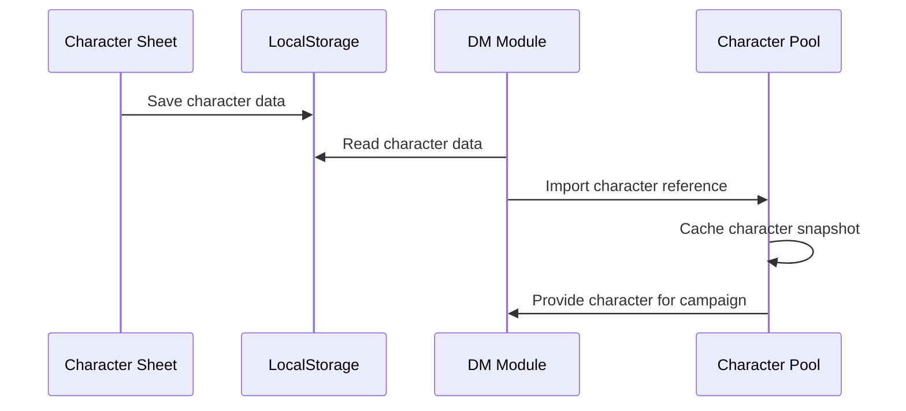

# Implementation Phases - Step-by-Step Development Plan

## 🎯 Overview

This document outlines the step-by-step implementation plan for the DM Toolset module. Each phase builds upon the previous one while maintaining non-breaking compatibility with existing functionality.

## 📅 Timeline & Milestones

### **Phase 1: Foundation** (Week 1-2)
- **Goal**: Establish DM module structure and basic campaign management
- **Risk**: Low - No changes to existing functionality
- **Deliverables**: DM routing, basic layout, campaign CRUD operations

### **Phase 2: Component Refactoring** (Week 2-3)
- **Goal**: Extract reusable components without breaking existing features
- **Risk**: Medium - Requires careful testing of existing functionality
- **Deliverables**: Shared component library, updated character sheet integration

### **Phase 3: Character Management** (Week 3-4)
- **Goal**: Character import system and cross-campaign persistence
- **Risk**: Medium - Data synchronization complexity
- **Deliverables**: Character import/export, shared character pool

### **Phase 4: Combat Tracker** (Week 4-5)
- **Goal**: Canvas-based combat management with initiative tracking
- **Risk**: High - Complex canvas integration and state management
- **Deliverables**: Combat canvas, initiative system, basic resource tracking

### **Phase 5: Advanced Features** (Week 5-6)
- **Goal**: Enhanced combat features and automation
- **Risk**: Medium - Feature complexity and performance
- **Deliverables**: Advanced resource tracking, conditions, automation

### **Phase 6: Polish & Integration** (Week 6-7)
- **Goal**: Performance optimization, UX refinements, documentation
- **Risk**: Low - Incremental improvements
- **Deliverables**: Performance optimizations, user documentation, testing

---

## 🏗️ Phase 1: Foundation (Week 1-2)

### **Goals**
- Set up DM module routing structure
- Create basic DM layout and navigation
- Implement campaign management system
- Establish data persistence patterns

### **Tasks**

#### 1.1 DM Module Routing Setup
```bash
# Create DM route structure
mkdir -p src/app/dm/{campaigns,settings}
mkdir -p src/app/dm/campaigns/{new,[campaignId]/{characters,combat,notes,encounters}}
```

**Files to Create:**
- `src/app/dm/layout.tsx` - DM module layout with navigation
- `src/app/dm/page.tsx` - DM dashboard
- `src/app/dm/campaigns/page.tsx` - Campaign list
- `src/app/dm/campaigns/new/page.tsx` - Create campaign
- `src/app/dm/campaigns/[campaignId]/page.tsx` - Campaign overview

#### 1.2 Data Structures & Types
**Files to Create:**
- `src/types/dm.ts` - Core DM types
- `src/types/campaign.ts` - Campaign data structures
- `src/types/combat.ts` - Combat encounter types

#### 1.3 State Management Setup
**Files to Create:**
- `src/store/dmStore.ts` - DM module state
- `src/store/campaignStore.ts` - Campaign management state

#### 1.4 Basic Campaign Management
**Components to Create:**
- `src/components/dm/CampaignManager/CampaignCard.tsx`
- `src/components/dm/CampaignManager/CampaignForm.tsx`
- `src/components/dm/CampaignManager/CampaignList.tsx`

### **Acceptance Criteria**
- [ ] DM routes accessible via `/dm` URL
- [ ] Campaign creation and listing works
- [ ] Campaign data persists in localStorage
- [ ] No impact on existing character sheet functionality
- [ ] Basic DM navigation between sections

### **Testing Checklist**
- [ ] All new routes render without errors
- [ ] Campaign CRUD operations work correctly
- [ ] Data persistence survives page refresh
- [ ] Character sheet still works normally
- [ ] No console errors or warnings

---

## 🧩 Phase 2: Component Refactoring (Week 2-3)

### **Goals**
- Extract reusable components from character sheet
- Create shared component library
- Maintain 100% backward compatibility
- Establish component design patterns

### **Tasks**

#### 2.1 Shared Component Library Setup
```bash
# Create shared component structure
mkdir -p src/components/shared/{character,stats,combat,spells,conditions}
```

#### 2.2 Character Display Components
**Priority Extraction Order:**
1. **HitPointTracker** - Most reusable for combat
2. **AbilityScoreDisplay** - Core character stats
3. **SpellSlotDisplay** - Resource management
4. **ConditionTracker** - Status effects
5. **CharacterHeader** - Identity display

**Implementation Pattern:**
```typescript
// 1. Extract pure component
// src/components/shared/combat/HitPointTracker.tsx
export function HitPointTracker({ hitPoints, onUpdate, readonly }: Props) {
  // Pure component implementation
}

// 2. Update existing component (non-breaking)
// src/components/ui/HitPointManager.tsx  
export default function HitPointManager() {
  const store = useCharacterStore();
  return (
    <HitPointTracker
      hitPoints={store.character.hitPoints}
      onUpdate={store.updateHitPoints}
      readonly={false}
    />
  );
}
```

#### 2.3 Component Testing Strategy
- **Unit tests** for each extracted component
- **Integration tests** for character sheet compatibility
- **Visual regression tests** to catch UI changes
- **Performance tests** for rendering efficiency

### **Acceptance Criteria**
- [ ] All extracted components work in isolation
- [ ] Character sheet functionality unchanged
- [ ] Components support both player and DM contexts
- [ ] 100% test coverage for new shared components
- [ ] Documentation for component APIs

### **Risk Mitigation**
- **Feature flags** for new components
- **A/B testing** framework for component swapping
- **Rollback plan** for any breaking changes
- **Automated testing** to catch regressions

---

## 👥 Phase 3: Character Management (Week 3-4)

### **Goals**
- Implement character import system
- Create shared character pool for campaigns
- Build character synchronization logic
- Handle data conflicts gracefully

### **Tasks**

#### 3.1 Character Import System
**Components to Create:**
- `src/components/dm/CharacterManager/CharacterImport.tsx`
- `src/components/dm/CharacterManager/CharacterPool.tsx`
- `src/components/dm/CharacterManager/CharacterSync.tsx`

**Utilities to Create:**
- `src/utils/dm/characterImport.ts` - Import/export logic
- `src/utils/dm/characterSync.ts` - Synchronization utilities

#### 3.2 Data Synchronization
```typescript
// Character sync strategies
interface CharacterSyncOptions {
  strategy: 'manual' | 'auto' | 'ask';
  conflictResolution: 'dm_wins' | 'player_wins' | 'merge' | 'ask';
  syncFrequency: 'never' | 'on_load' | 'on_change' | 'real_time';
}
```

#### 3.3 Character Pool Management
- **Import Methods**: JSON files, localStorage sync, manual entry
- **Conflict Resolution**: UI for handling data discrepancies
- **Bulk Operations**: Import multiple characters, bulk updates

### **Acceptance Criteria**
- [ ] Characters can be imported from JSON exports
- [ ] Character pool persists across sessions
- [ ] Sync status clearly displayed for each character
- [ ] Conflict resolution UI handles data mismatches
- [ ] Character updates don't affect original character sheet

### **Data Flow**


---

## ⚔️ Phase 4: Combat Tracker (Week 4-5)

### **Goals**
- Adapt notes canvas for combat tracking
- Implement initiative system
- Create drag-drop character/monster tokens
- Basic resource tracking during combat

### **Tasks**

#### 4.1 Combat Canvas Adaptation
**Base on Existing Canvas:**
- Extend React Flow notes canvas for combat use
- Add grid overlay and measurement tools
- Implement character/monster tokens
- Position tracking and persistence

#### 4.2 Initiative System
**Components to Create:**
- `src/components/dm/InitiativeTracker/InitiativeList.tsx`
- `src/components/dm/InitiativeTracker/TurnTracker.tsx`
- `src/components/dm/InitiativeTracker/InitiativeRoller.tsx`

#### 4.3 Combat Participant Management
```typescript
// Combat participant token
interface CombatToken {
  participantId: string;
  position: Position;
  size: TokenSize;
  healthStatus: 'healthy' | 'wounded' | 'critical' | 'unconscious';
  turnStatus: 'waiting' | 'current' | 'acted';
  conditions: ActiveCondition[];
}
```

#### 4.4 Bestiary Integration
- **Quick Add**: Drag monsters from bestiary to combat
- **Stat Block Reference**: Quick access to monster stats
- **Multiple Instances**: Same monster type with individual tracking

### **Acceptance Criteria**
- [ ] Combat canvas displays character and monster tokens
- [ ] Initiative tracking with automatic turn advancement
- [ ] Drag-drop from character pool and bestiary works
- [ ] Basic HP/AC tracking for all participants
- [ ] Combat state persists across page reloads

### **Technical Challenges**
- **Performance**: Handle large numbers of tokens efficiently
- **Synchronization**: Keep canvas and data in sync
- **User Experience**: Intuitive drag-drop interactions
- **Mobile Support**: Touch-friendly combat interface

---

## 🔧 Phase 5: Advanced Features (Week 5-6)

### **Goals**
- Enhanced resource tracking (spell slots, abilities, conditions)
- Combat automation features
- Advanced bestiary integration
- Performance optimizations

### **Tasks**

#### 5.1 Advanced Resource Tracking
- **Spell Slot Management**: Track usage for all casters
- **Special Abilities**: Cooldown and usage tracking
- **Conditions & Effects**: Duration and automatic removal
- **Custom Resources**: User-defined trackable resources

#### 5.2 Combat Automation
**Features to Implement:**
- **Automatic Condition Expiry**: Remove expired conditions
- **Damage/Healing Automation**: Apply area effects
- **Turn Reminders**: Notify about ongoing effects
- **Dice Integration**: Automated rolling for common actions

#### 5.3 Advanced Canvas Features
- **Area of Effect Templates**: Visual spell/ability areas
- **Line of Sight**: Basic visibility calculations
- **Measurement Tools**: Distance and range checking
- **Custom Tokens**: Upload custom character/monster images

### **Acceptance Criteria**
- [ ] All character resources tracked accurately
- [ ] Conditions automatically expire when appropriate
- [ ] AoE templates work for common spell shapes
- [ ] Performance remains smooth with 20+ participants
- [ ] Undo/redo functionality for combat actions

---

## 🎨 Phase 6: Polish & Integration (Week 6-7)

### **Goals**
- Performance optimization and mobile support
- User experience refinements
- Comprehensive testing and documentation
- Integration with existing features

### **Tasks**

#### 6.1 Performance Optimization
- **Canvas Rendering**: Optimize React Flow performance
- **State Management**: Reduce unnecessary re-renders
- **Memory Usage**: Clean up unused combat data
- **Mobile Performance**: Touch-optimized interactions

#### 6.2 User Experience Enhancements
- **Keyboard Shortcuts**: Common DM actions
- **Tooltips & Help**: Contextual assistance
- **Accessibility**: Screen reader and keyboard support
- **Responsive Design**: Mobile and tablet layouts

#### 6.3 Documentation & Training
- **User Guide**: Step-by-step DM workflows
- **Video Tutorials**: Common use cases
- **API Documentation**: Component and store APIs
- **Migration Guide**: Upgrading from player-only usage

### **Acceptance Criteria**
- [ ] Smooth performance on mobile devices
- [ ] Comprehensive user documentation
- [ ] Accessibility compliance (WCAG 2.1 AA)
- [ ] Zero known bugs in core functionality
- [ ] User feedback incorporation

---

## 🧪 Quality Assurance Throughout

### **Testing Strategy**
1. **Unit Tests**: All new components and utilities
2. **Integration Tests**: DM and player workflow testing
3. **E2E Tests**: Complete campaign and combat scenarios
4. **Performance Tests**: Canvas performance with large encounters
5. **Accessibility Tests**: Screen reader and keyboard navigation
6. **Mobile Tests**: Touch interactions and responsive layouts

### **Continuous Integration**
- **Automated Testing**: Run full test suite on every commit
- **Visual Regression**: Catch UI changes automatically
- **Performance Monitoring**: Track rendering performance
- **Bundle Size**: Monitor impact on app size

### **User Testing**
- **DM Beta Program**: Recruit volunteer DMs for testing
- **Feedback Collection**: In-app feedback mechanisms
- **Usage Analytics**: Track feature adoption and usage patterns
- **Iterative Improvements**: Regular updates based on feedback

---

## 📋 Phase Completion Checklist

### **Phase 1 Complete When:**
- [ ] All DM routes accessible and functional
- [ ] Basic campaign management working
- [ ] Data persistence established
- [ ] No regressions in character sheet

### **Phase 2 Complete When:**
- [ ] Shared components extracted and tested
- [ ] Character sheet still works identically
- [ ] Component library documented
- [ ] Performance benchmarks met

### **Phase 3 Complete When:**
- [ ] Character import system functional
- [ ] Character pool management working
- [ ] Sync conflicts handled gracefully
- [ ] Data integrity maintained

### **Phase 4 Complete When:**
- [ ] Combat tracker fully functional
- [ ] Initiative system working
- [ ] Bestiary integration complete
- [ ] Basic combat workflows supported

### **Phase 5 Complete When:**
- [ ] Advanced features implemented
- [ ] Automation features working
- [ ] Performance targets met
- [ ] Edge cases handled

### **Phase 6 Complete When:**
- [ ] Documentation complete
- [ ] User testing feedback addressed
- [ ] Performance optimized
- [ ] Ready for general release

---

This phased approach ensures steady progress while maintaining the stability and functionality that your players already rely on.
